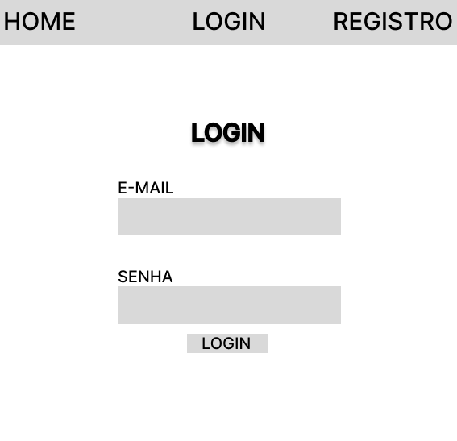
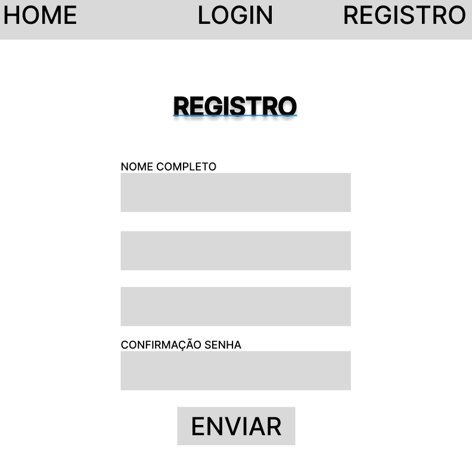
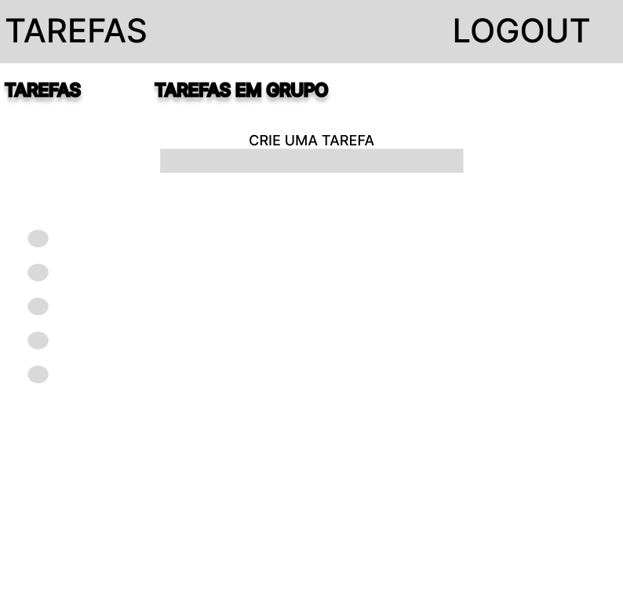

1. **Escopo Funcional: O que o sistema deve fazer**
Funcionalidades Principais:

Autenticação de Usuários:

Registro e login com verificação de e-mail.
Utilização de JSON Web Tokens (JWT) para autenticação e gerenciamento de sessões.
Gerenciamento de Tarefas:

Adicionar, editar e excluir tarefas.
Marcar tarefas como concluídas e visualizar status.
Organizar tarefas por categorias ou tags.
Ordenar e filtrar tarefas por data, prioridade ou status.
Interface de Usuário:

Interface intuitiva e responsiva utilizando React.
Painel de controle com visualização de tarefas pendentes e concluídas.
Funcionalidade de arrastar e soltar para reordenar tarefas.
Notificações e Alertas:

Notificações para prazos de tarefas e lembretes.
Alertas para atividades importantes.
Histórico e Relatórios:

Visualização do histórico de tarefas concluídas.
Geração de relatórios de produtividade e estatísticas de tarefas.
2. Escopo Não Funcional: Como o sistema deve desempenhar as funções
Desempenho e Escalabilidade:

Segurança:

Criptografia de dados sensíveis, como senhas e tokens de sessão.
Proteção contra ataques comuns (e.g., CSRF, XSS, SQL Injection).
Controle de acesso baseado em permissões de usuário.
Usabilidade:

Interface amigável e intuitiva.
Acessibilidade para diferentes dispositivos (mobile, tablet, desktop).
Performance otimizada para carregamento rápido e responsivo.
Escalabilidade:

Estrutura modular e escalável utilizando Node.js e MongoDB.
Capacidade para adicionar novas funcionalidades e suportar um aumento no número de usuários.
Manutenibilidade:

Código limpo e bem documentado.
Testes automatizados para garantir a estabilidade do sistema.
Atualizações e manutenção contínua.
3. **Objetivos SMART**
Específico: Desenvolver uma aplicação web de To-Do List com funcionalidades de autenticação, gerenciamento de tarefas, e notificações.
Mensurável: A aplicação deve ser capaz de suportar pelo menos 1.000 usuários simultâneos e oferecer uma taxa de resposta de menos de 2 segundos para ações principais.
Atingível: Utilizar tecnologias e frameworks modernos como React, Node.js, MongoDB e JWT, que são amplamente suportados e bem documentados.
Relevante: Melhorar a eficiência e organização das tarefas para os colaboradores da Escola SENAI, ajudando-os a gerenciar suas atividades diárias de forma mais eficaz.
Temporal: Concluir o desenvolvimento e a implementação da aplicação em 3 meses.
4. **Cronograma - Diagrama de Gantt**
Semana 1-2:

Análise de requisitos e definição do escopo.
Pesquisa de tecnologias e ferramentas.
Semana 3-4:

Configuração do ambiente de desenvolvimento.
Implementação da autenticação de usuários.
Semana 5-6:

Desenvolvimento das funcionalidades principais de gerenciamento de tarefas.
Criação da interface de usuário com React.
Semana 7-8:

Implementação das notificações e alertas.
Desenvolvimento de histórico e relatórios.
Semana 9-10:

Testes e ajustes de usabilidade.
Implementação de segurança e revisão de código.
Semana 11-12:

Implantação e treinamento para os usuários finais.
Coleta de feedback e ajustes finais.
5. **Análise de Risco**
Principais Riscos e Mitigações:

Risco de Atrasos no Cronograma:

Mitigação: Planejamento detalhado e revisões regulares do progresso.
Risco de Problemas de Segurança:

Mitigação: Implementação de práticas de segurança recomendadas e testes de segurança.
Risco de Baixa Usabilidade:

Mitigação: Testes com usuários reais e ajustes baseados no feedback.
Risco de Falhas Técnicas:

Mitigação: Testes automatizados e revisão de código por pares.
6. **Recursos**
Equipe:

Desenvolvedores front-end e back-end.
Designer de UI/UX.
Especialista em segurança.
Testadores.
Ferramentas e Tecnologias:

Frontend: React, HTML, CSS.
Backend: Node.js, Express.js.
Banco de Dados: MongoDB.
Autenticação: JSON Web Tokens (JWT).
Ferramentas de Desenvolvimento: Git, Docker (para contêineres), ferramentas de CI/CD.

diagrama de fluxo

1. Diagrama de Classes
O Diagrama de Classes descreve a estrutura do sistema, mostrando as classes principais, seus atributos e métodos, e como elas se relacionam.
Principais Classes:
    1.	User
o	Atributos:
	userId: String
	username: String
	email: String
	passwordHash: String
	createdAt: Date
o	Métodos:
	register()
	login()
	updateProfile()
	deleteAccount()
    2.	Task
o	Atributos:
	taskId: String
	title: String
	description: String
	status: String (e.g., Pending, Completed)
	dueDate: Date
	priority: String (e.g., Low, Medium, High)
	createdAt: Date
	updatedAt: Date
o	Métodos:
	createTask()
	updateTask()
	deleteTask()
	markAsComplete()
    3.	Category
o	Atributos:
	categoryId: String
	name: String
	description: String
o	Métodos:
	addCategory()
	updateCategory()
	removeCategory()
    4.	Notification
o	Atributos:
	notificationId: String
	message: String
	type: String (e.g., Reminder, Alert)
	userId: String
o	Métodos:
	sendNotification()
	deleteNotification()
    5.	Report
o	Atributos:
	reportId: String
	userId: String
	dateRange: DateRange
	summary: String
o	Métodos:
	generateReport()
	viewReport()
Relações:
•	Um User pode ter várias Tasks.
•	Um Task pode pertencer a uma ou mais Categorys.
•	Um User pode receber várias Notifications.
•	Relacionamento entre User e Report é de um-para-muitos.
2. Diagrama de Casos de Uso
O Diagrama de Casos de Uso ilustra as interações entre os usuários e o sistema, destacando as funcionalidades principais.
Atores:
•	Usuário (User)
•	Administrador (Admin) (opcional, para gerenciamento adicional)
Casos de Uso:
    1.	Registrar-se:
o	Ator: Usuário
o	Descrição: O usuário se registra na aplicação fornecendo informações como nome, e-mail e senha.
    2.	Login:
o	Ator: Usuário
o	Descrição: O usuário faz login utilizando seu e-mail e senha.
    3.	Adicionar Tarefa:
o	Ator: Usuário
o	Descrição: O usuário cria uma nova tarefa com título, descrição, data de vencimento e prioridade.
    4.	Editar Tarefa:
o	Ator: Usuário
o	Descrição: O usuário modifica os detalhes de uma tarefa existente.
    5.	Excluir Tarefa:
o	Ator: Usuário
o	Descrição: O usuário exclui uma tarefa que não é mais necessária.
    6.	Marcar Tarefa como Concluída:
o	Ator: Usuário
o	Descrição: O usuário marca uma tarefa como concluída.
    7.	Visualizar Notificações:
o	Ator: Usuário
o	Descrição: O usuário visualiza as notificações relacionadas às suas tarefas.
    8.	Gerar Relatório de Produtividade:
o	Ator: Usuário
o	Descrição: O usuário gera e visualiza relatórios sobre suas tarefas e produtividade.
Relacões:
•	O ator "Usuário" se relaciona com todos os casos de uso listados.
3. Diagrama de Fluxo
O Diagrama de Fluxo mostra o processo de uma tarefa específica dentro do sistema, como a adição de uma nova tarefa.
Fluxo para Adicionar uma Tarefa:
    1.	Início
    2.	Usuário Clica em "Adicionar Tarefa"
o	Verifica se o usuário está autenticado.
    3.	Sistema Exibe Formulário de Adição de Tarefa
o	Campos: Título, Descrição, Data de Vencimento, Prioridade.
    4.	Usuário Preenche o Formulário
o	Verifica se todos os campos obrigatórios estão preenchidos.
    5.	Usuário Clica em "Salvar"
o	Sistema valida os dados do formulário.
    6.	Sistema Adiciona a Tarefa ao Banco de Dados
o	Cria uma nova entrada para a tarefa com os detalhes fornecidos.
    7.	Sistema Exibe Mensagem de Sucesso
o	Notifica o usuário sobre a criação bem-sucedida da tarefa.
    8.	Tarefa Adicionada à Lista de Tarefas do Usuário
    9.	Fim
Fluxo Alternativo:
•	Se houver um erro de validação, o sistema exibe uma mensagem de erro e solicita ao usuário que corrija os dados.

PROTOTIPAGEM

